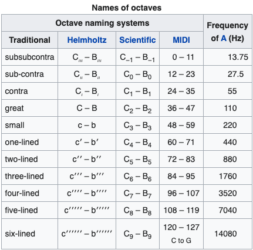

# Projekt AAI
```bash
> Nikodem Strawa - s19440
> Iwona Piętka - s19330
```

## Prerequisites
```
$ python -m pip install -r requirements.txt
```


## Concept
* Model receives X notes and predicts next note
* The note consists of `(pitch, step, duration)`
* From predicted notes a song is generated by a script using a provided model
* There are 3 architectures `[gan, lstm, ResNet]`

## Classes of pitches

> Source: [Wiki](https://en.wikipedia.org/wiki/Musical_note)


## Running the model

### GAN
```bash
$ python gan.py
```

### LSTM
```bash
$ python lstm.py
```

### ResNet
```bash
$ python resnet.py
```
